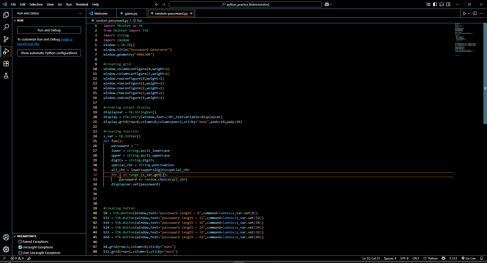
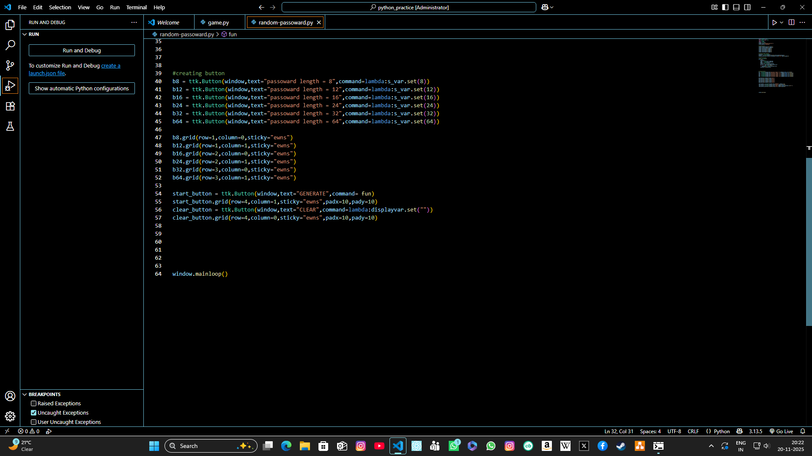
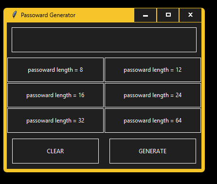

---

🛡 Random Password Generator (Python + Tkinter)

This is a simple and user-friendly Random Password Generator built using Python and Tkinter.
It allows users to generate strong passwords with adjustable length and includes uppercase letters, lowercase letters, digits, and symbols.

---

🔥 Features

Generate strong and secure passwords

Adjustable password length

Include uppercase, lowercase, digits & symbols

Clean Tkinter GUI

Comes with both .py (source code) and .exe (Windows executable)

Screenshots included for preview

---

📦 Files Included

├── random-passoward.py
├── random-passoward.exe
├── mysetup.exe
├── README.md
├── LICENSE
├── .gitignore
├── Screenshot 2025-11-20 202220.png
├── Screenshot 2025-11-20 202236.png
└── Screenshot 2025-11-20 202354.png

---

🚀 How to Run

▶ Run Using Python

Make sure Python is installed, then run:

python random-passoward.py

▶ Run Without Python (Windows)

Just open:

random-passoward.exe

or

mysetup.exe

---

📸 Screenshots

(তোমার তিনটি screenshot ব্যবহার করো)

---

🧰 Requirements

Python 3.8+

Tkinter (already included with Python)

Optional (if you want to build .exe):

PyInstaller

---

📝 License

This project is released under the MIT License.

---

🙌 Author

Created by Asif
Feel free to ⭐ star the repository!

---
